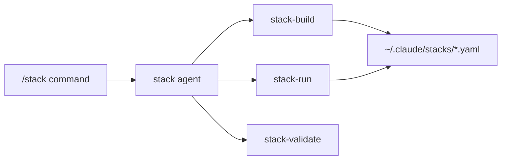
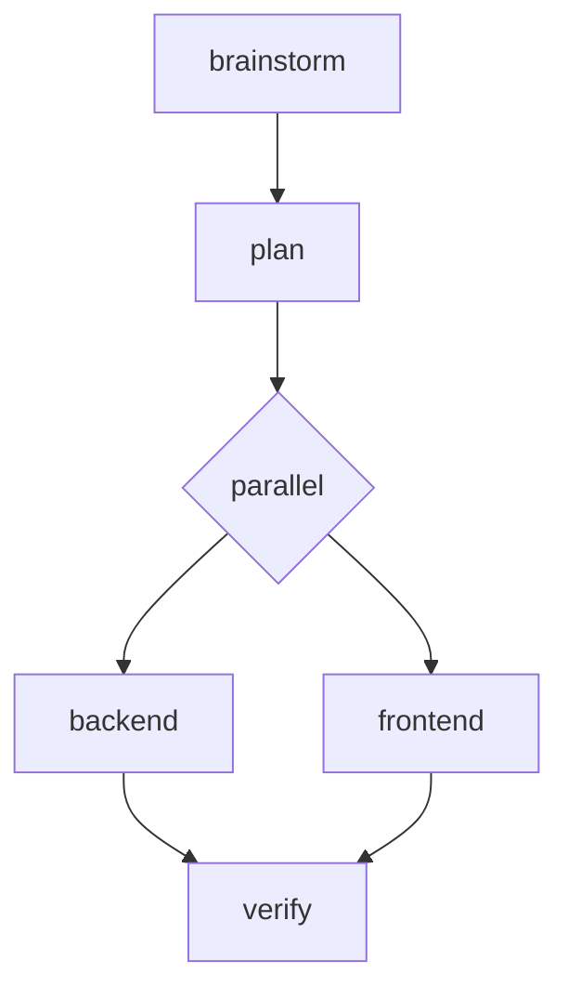
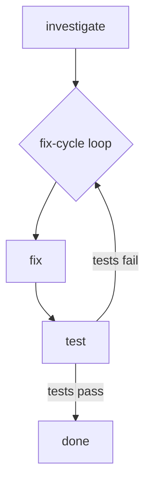
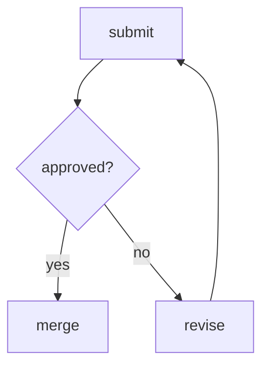
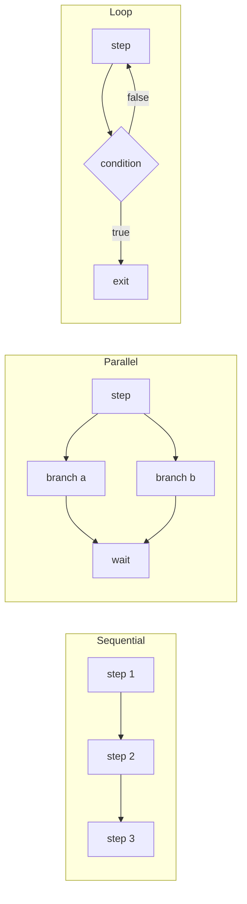

# Skill Stack

Build and run personalized skill workflows through Socratic guidance.

## The Problem

You have dozens of skills available, but using them effectively means:
- Remembering which skills apply to each task type
- Chaining them in the right order
- Switching between skills at the right time

A backend developer's workflow differs from a frontend developer's. A bug fix needs different skills than a new feature. One-size-fits-all doesn't work.

## The Solution

Skill Stack lets you define reusable workflows in YAML that chain skills, commands, and scripts—with support for parallel execution, loops, and conditional branching.

Build once with guided questions. Run anytime with `/stack my-workflow`.



## Installation

```bash
# Add marketplace
/plugin marketplace add git@github.com:anthropics/skill-stack-marketplace.git

# Install plugin
/plugin install skill-stack@skill-stack-marketplace
```

## Quick Start

```bash
# Build your first stack (guided)
/stack build

# Run a saved stack
/stack my-workflow

# List all stacks
/stack list

# Edit an existing stack
/stack edit my-workflow
```

| Scope | Location |
|-------|----------|
| Personal | `~/.claude/stacks/*.yaml` |
| Project | `.claude/stacks/*.yaml` |

## Building a Stack

When you run `/stack build`, the builder guides you through questions:

```
> /stack build

What kind of workflow are you building?
1. Feature development
2. Bug fixing
3. Code review
4. Custom

> 1

Which skills should run first?
1. brainstorming
2. write-plan
3. tdd
4. Other

> 1, 2

Should backend and frontend run in parallel or sequential?
1. Parallel (faster, uses subagents)
2. Sequential (simpler)

> 1

...

Where should I save 'my-feature' stack?
1. Personal (~/.claude/stacks/) - Available across all projects
2. Project (.claude/stacks/) - Shared with team via git

> 1

✓ Stack saved to ~/.claude/stacks/my-feature.yaml
```

No YAML knowledge required. The builder creates valid workflows from your answers.

## Example Workflows

### Adding a New Feature

You're adding user authentication. You need to brainstorm requirements, plan the approach, then implement backend and frontend in parallel.

```yaml
name: new-feature
description: Feature development with parallel implementation
steps:
  - name: brainstorm
    type: skill
    ref: brainstorming

  - name: plan
    type: skill
    ref: write-plan

  - parallel:
      name: implement
      wait: all
      branches:
        - name: backend
          type: skill
          ref: tdd
          args: "backend API"
        - name: frontend
          type: skill
          ref: tdd
          args: "frontend UI"

  - name: verify
    type: bash
    run: npm test && npm run build
```



### Fixing a Bug

Tests are failing. You need to investigate, fix, and verify—repeating until all tests pass.

```yaml
name: fix-bug
description: Debug loop until tests pass
steps:
  - name: investigate
    type: skill
    ref: debugging

  - loop:
      name: fix-cycle
      until: "{{ tests_pass }}"
      max_iterations: 10
      steps:
        - name: fix
          type: skill
          ref: debugging
          args: "apply fix"

        - name: test
          type: bash
          run: npm test
          outputs:
            - tests_pass
```



### Code Review Cycle

Submit for review. If approved, merge. If not, revise and resubmit.

```yaml
name: review-cycle
description: Review with conditional branching
steps:
  - name: submit
    type: skill
    ref: request-review
    outputs:
      - approved

  - name: check
    branch:
      if: "{{ approved }}"
      then: merge
      else: revise

  - name: revise
    type: skill
    ref: apply-feedback
    branch:
      if: "true"
      then: submit

  - name: merge
    type: command
    ref: /commit
```



## How Execution Works



Steps execute sequentially by default. Use `parallel:` blocks for concurrent work via subagents. Use `loop:` blocks for iterative workflows with exit conditions.

## Skills

| Skill | Description |
|-------|-------------|
| `stack-build` | Guided workflow creation through Socratic questions |
| `stack-run` | Execution engine for running workflows |
| `stack-validate` | Validates YAML and offers conversational fixes |
| `wcag-verify` | WCAG 2.1 A/AA accessibility reviewer for frontend files |
| `test-quality-verify` | Strict test quality gatekeeper - blocks trivial, shallow, and useless tests |
| `dev-verify` | Development completion gatekeeper - tests, coverage, lint, and test quality |

## Documentation

- [YAML Schema](references/yaml-schema.md) - Complete specification
- [Step Types](references/step-types.md) - skill, command, bash, stack
- [Loop Patterns](references/loop-patterns.md) - until, while, times, for_each
- [Examples](references/example-stacks.md) - More workflow patterns

## License

MIT
