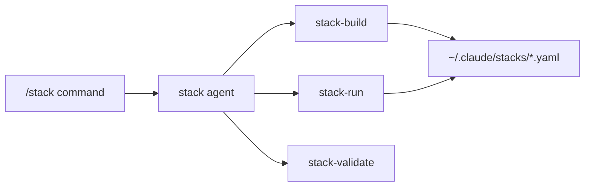
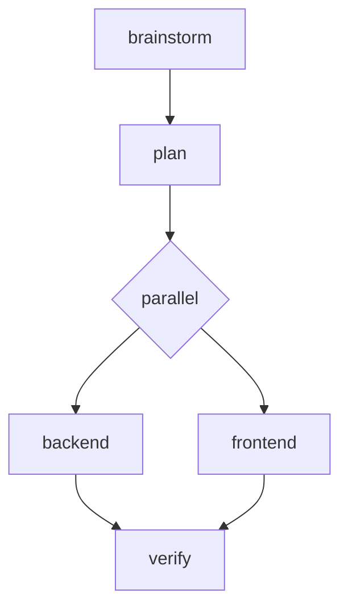
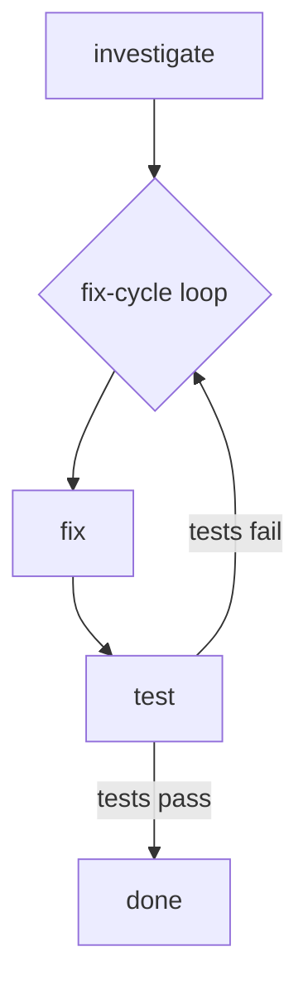
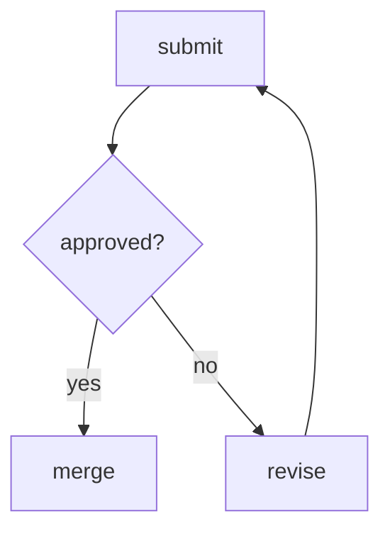
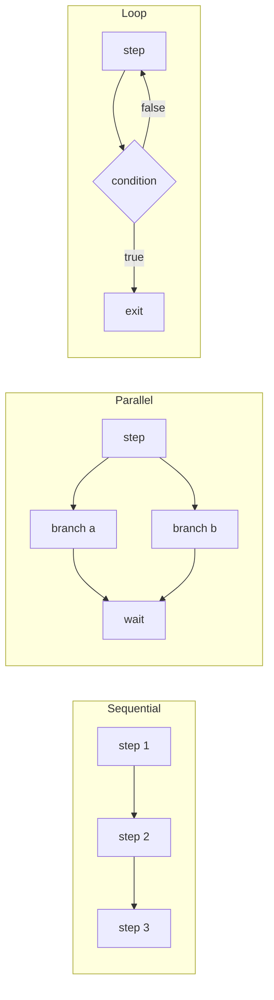

# Skill Stack

Build and run personalized skill workflows through Socratic guidance.

## The Problem

You have dozens of skills available, but using them effectively means:
- Remembering which skills apply to each task type
- Chaining them in the right order
- Switching between skills at the right time

A backend developer's workflow differs from a frontend developer's. A bug fix needs different skills than a new feature. One-size-fits-all doesn't work.

## The Solution

Skill Stack lets you define reusable workflows in YAML that chain skills, commands, and scripts—with support for parallel execution, loops, and conditional branching.

Build once with guided questions. Run anytime with `/stack my-workflow`.



## Installation

```bash
# Add marketplace
/plugin marketplace add git@github.com:anthropics/skill-stack-marketplace.git

# Install plugin
/plugin install skill-stack@skill-stack-marketplace
```

## Quick Start

```bash
# Build your first stack (guided)
/stack build

# Run a saved stack
/stack my-workflow

# List all stacks
/stack list

# Edit an existing stack
/stack edit my-workflow
```

| Scope | Location |
|-------|----------|
| Personal | `~/.claude/stacks/*.yaml` |
| Project | `.claude/stacks/*.yaml` |

## Building a Stack

When you run `/stack build`, the builder guides you through questions with **intelligent skill suggestions**:

```
> /stack build

What's your primary role?
→ Backend developer

What kind of task is this stack for?
→ Bug fix

What slows you down?
→ Quality issues

Based on your context (Backend developer, Bug fix, Quality issues):

Recommended workflow:
1. systematic-debugging - Investigate the issue
2. test-driven-development - Write test, then fix
3. test-quality-verify - Ensure tests are meaningful
4. verification-before-completion - Final checks

Use this workflow or customize?
→ Use recommended

Where should I save 'bug-fix' stack?
→ Project (.claude/stacks/)

✓ Stack saved to .claude/stacks/bug-fix.yaml
```

### Intelligent Suggestions

The builder analyzes your context and suggests relevant skills:

| Context | Suggested Skills |
|---------|------------------|
| **New feature** | brainstorming → writing-plans → test-driven-development → verification |
| **Bug fix** | systematic-debugging → test-driven-development → verification |
| **Code review** | requesting-code-review → receiving-code-review → verification |
| **Frontend role** | frontend-design, wcag-verify |
| **Quality issues** | test-quality-verify, dev-verify |

### Custom Skill Creation

When no existing skill matches your needs, create one on-the-fly:

```
No matching skill found. Would you like to create one?
→ Create custom skill

What should this skill be called?
→ api-performance-check

Briefly describe what this skill does:
→ Check API response times and identify slow endpoints

What should Claude do when this skill is invoked?
→ Run API performance tests, measure response times, report slow endpoints

✓ Created skill 'api-performance-check' at .claude/skills/api-performance-check/SKILL.md
```

Custom skills are saved to your **project repository** (`.claude/skills/`) so they can be shared with your team via git.

No YAML knowledge required. The builder creates valid workflows from your answers.

## Example Workflows

### Adding a New Feature

You're adding user authentication. You need to brainstorm requirements, plan the approach, then implement backend and frontend in parallel.

```yaml
name: new-feature
description: Feature development with parallel implementation
steps:
  - name: brainstorm
    type: skill
    ref: brainstorming

  - name: plan
    type: skill
    ref: write-plan

  - parallel:
      name: implement
      wait: all
      branches:
        - name: backend
          type: skill
          ref: tdd
          args: "backend API"
        - name: frontend
          type: skill
          ref: tdd
          args: "frontend UI"

  - name: verify
    type: bash
    run: npm test && npm run build
```



### Fixing a Bug

Tests are failing. You need to investigate, fix, and verify—repeating until all tests pass.

```yaml
name: fix-bug
description: Debug loop until tests pass
steps:
  - name: investigate
    type: skill
    ref: debugging

  - loop:
      name: fix-cycle
      until: "{{ tests_pass }}"
      max_iterations: 10
      steps:
        - name: fix
          type: skill
          ref: debugging
          args: "apply fix"

        - name: test
          type: bash
          run: npm test
          outputs:
            - tests_pass
```



### Code Review Cycle

Submit for review. If approved, merge. If not, revise and resubmit.

```yaml
name: review-cycle
description: Review with conditional branching
steps:
  - name: submit
    type: skill
    ref: request-review
    outputs:
      - approved

  - name: check
    branch:
      if: "{{ approved }}"
      then: merge
      else: revise

  - name: revise
    type: skill
    ref: apply-feedback
    branch:
      if: "true"
      then: submit

  - name: merge
    type: command
    ref: /commit
```



## How Execution Works



Steps execute sequentially by default. Use `parallel:` blocks for concurrent work via subagents. Use `loop:` blocks for iterative workflows with exit conditions.

## Skills

| Skill | Description |
|-------|-------------|
| `stack-build` | Guided workflow creation through Socratic questions |
| `stack-run` | Execution engine for running workflows |
| `stack-validate` | Validates YAML and offers conversational fixes |
| `wcag-verify` | WCAG 2.1 A/AA accessibility reviewer for frontend files |
| `test-quality-verify` | Strict test quality gatekeeper - blocks trivial, shallow, and useless tests |
| `dev-verify` | Development completion gatekeeper - tests, coverage, lint, and test quality |

## Configuration (Optional)

Create `.claude/skill-stack.local.md` in your project for custom settings:

```markdown
---
preferred_model: sonnet
default_location: project
auto_validate: true
default_transition: prompt
---

# Project-specific notes

Any additional context for stack execution in this project.
```

| Setting | Values | Default | Description |
|---------|--------|---------|-------------|
| `preferred_model` | sonnet, opus, haiku | sonnet | Model for stack agent |
| `default_location` | personal, project | (ask) | Default save location |
| `auto_validate` | true, false | true | Validate before running |
| `default_transition` | auto, prompt, pause | prompt | Step transition mode |

This file is project-local and should be added to `.gitignore` if it contains personal preferences.

## Documentation

- [YAML Schema](references/yaml-schema.md) - Complete specification
- [Step Types](references/step-types.md) - skill, command, bash, stack
- [Loop Patterns](references/loop-patterns.md) - until, while, times, for_each
- [Examples](references/example-stacks.md) - More workflow patterns

## License

MIT
