```mermaid
flowchart TD
  classDef skill fill:#e1f5fe,stroke:#01579b
  classDef bash fill:#f3e5f5,stroke:#4a148c
  classDef command fill:#e8f5e9,stroke:#1b5e20

  brainstorm[brainstorm\n🧠 superpowers:brainstorming]:::skill
  test[test\n💻 npm test]:::bash
  commit[commit\n⌨️ /commit]:::command

  brainstorm --> test --> commit
```

```mermaid
flowchart TD
  brainstorm[brainstorm]

  subgraph parallel_impl[⚡ Parallel: implementation]
    direction LR
    backend[backend\n💻 npm run backend]
    frontend[frontend\n💻 npm run frontend]
    tests[tests\n💻 npm run tests]
  end

  verify[verify]

  brainstorm --> parallel_impl
  parallel_impl --> verify
```

```mermaid
flowchart TD
  start[start\n💻 echo start]

  subgraph loop_quality[🔄 Loop: quality-check\nuntil: tests_pass]
    direction TB
    run_test[run-test\n💻 npm test]
    check{tests_pass?}
    fix[fix\n🧠 debugging]

    run_test --> check
    check -->|❌ false| fix
    fix --> run_test
  end

  done[done\n💻 echo done]

  start --> loop_quality
  check -->|✅ true| done
```

```mermaid
flowchart TD
  checks[checks\n💻 run checks]
  decision{check_passed?}
  success[success-path\n💻 deploy]
  failure[failure-path\n🧠 debugging]
  notify[notify\n💻 notify]

  checks --> decision
  decision -->|✅ true| success
  decision -->|❌ false| failure
  success --> notify
  failure --> notify
```

```mermaid
flowchart TD
  classDef skill fill:#e1f5fe,stroke:#01579b
  classDef bash fill:#f3e5f5,stroke:#4a148c

  brainstorm[brainstorm\n🧠 Exploration]:::skill
  plan[plan\n📋 Planning]:::skill

  subgraph parallel_impl[⚡ Parallel: implementation]
    backend[backend\n🔧 TDD]:::skill
    frontend[frontend\n🎨 TDD]:::skill
  end

  subgraph loop_quality[🔄 Loop: quality-loop\nuntil: all_tests_pass]
    run_tests[run-tests\n💻 npm test]:::bash
    check_tests{all_tests_pass?}
    fix_issues[fix-issues\n🔧 Debugging]:::skill

    run_tests --> check_tests
    check_tests -->|❌| fix_issues
    fix_issues --> run_tests
  end

  verify[verify\n✓ Verification]:::skill
  review[review\n👀 Code review]:::skill

  decision{review_passed?}
  finish[finish\n🏁 Complete]:::skill

  brainstorm --> plan
  plan --> parallel_impl
  parallel_impl --> loop_quality
  check_tests -->|✅| verify
  verify --> review
  review --> decision
  decision -->|✅| finish
  decision -->|❌| loop_quality
```

```mermaid
flowchart TD
  only_step[step-name\n🧠 skill:name]
```

# Mermaid Diagram Test Cases

> Test cases for auto-generation and update of Mermaid diagrams in stack-builder

---

## Test Category 1: Diagram Creation (New Stack)

### TC-M1.1: Simple Sequential Stack Diagram

**Trigger:** `/stack build` → create stack with 3 sequential steps

**Input (via Socratic flow):**
- Step 1: skill `superpowers:brainstorming`
- Step 2: bash `npm test`
- Step 3: command `/commit`

**Expected `_meta.diagram`:**


**Verification:**
- [ ] Diagram exists in `_meta.diagram`
- [ ] All 3 steps represented as nodes
- [ ] Correct node shapes/styles per type
- [ ] Sequential flow arrows present
- [ ] Emoji indicators match step types

---

### TC-M1.2: Parallel Block Diagram

**Trigger:** `/stack build` → create stack with parallel block

**Input:**
- Step 1: skill `brainstorming`
- Parallel block with 3 branches:
  - Branch A: bash `npm run backend`
  - Branch B: bash `npm run frontend`
  - Branch C: bash `npm run tests`
- Step 2: skill `verification`

**Expected `_meta.diagram`:**


**Verification:**
- [ ] Parallel block rendered as subgraph
- [ ] All branches inside subgraph
- [ ] Subgraph labeled with parallel name
- [ ] Entry/exit arrows to subgraph (not individual nodes)

---

### TC-M1.3: Loop Block Diagram

**Trigger:** `/stack build` → create stack with loop

**Input:**
- Step 1: bash `echo start`
- Loop block (until: `tests_pass`, max: 5):
  - Step: bash `npm test` (outputs: tests_pass)
  - Step: skill `debugging` (when: not tests_pass)
- Step 2: bash `echo done`

**Expected `_meta.diagram`:**


**Verification:**
- [ ] Loop rendered as subgraph
- [ ] Condition shown as diamond node
- [ ] Loop-back arrow present
- [ ] Exit condition labeled
- [ ] Max iterations shown in subgraph label

---

### TC-M1.4: Branch/Conditional Diagram

**Trigger:** `/stack build` → create stack with branching

**Input:**
- Step 1: bash `run checks` (outputs: check_passed)
- Branch step:
  - if: `check_passed`
  - then: `success-path`
  - else: `failure-path`
- success-path: bash `deploy`
- failure-path: skill `debugging`
- end: bash `notify`

**Expected `_meta.diagram`:**


**Verification:**
- [ ] Decision node is diamond shape
- [ ] Both branches clearly labeled
- [ ] Conditional labels on arrows (true/false)
- [ ] Both paths converge correctly

---

### TC-M1.5: Complex Combined Diagram

**Trigger:** `/stack build` → create fullstack-feature style stack

**Input:** Full E2E-1 scenario workflow

**Expected `_meta.diagram`:**


**Verification:**
- [ ] All step types correctly styled
- [ ] Nested parallel and loop subgraphs
- [ ] Branch from review back to loop
- [ ] Complete flow from start to finish
- [ ] All labels and emojis correct

---

## Test Category 2: Diagram Update (Edit Stack)

### TC-M2.1: Add Step - Diagram Updates

**Setup:** Existing stack with diagram (3 steps)

**Trigger:** `/stack edit test-stack` → add step between step 2 and 3

**Action:**
```
Claude: "What would you like to change?"
User: "Add a step"
Claude: "Where should it go?"
User: "After step 2"
Claude: "What type of step?"
User: Bash step, run: "npm run lint"
```

**Expected Changes:**
- New node added in correct position
- Arrows updated to include new node
- Checksum regenerated
- `_meta.modified_at` updated

**Verification:**
- [ ] New node appears in diagram
- [ ] Flow arrows correct (step2 → new → step3)
- [ ] Old diagram replaced completely
- [ ] No orphan nodes

---

### TC-M2.2: Remove Step - Diagram Updates

**Setup:** Existing stack with 4 steps

**Trigger:** `/stack edit test-stack` → remove step 2

**Expected Changes:**
- Node removed from diagram
- Arrows reconnect (step1 → step3)
- Subgraphs adjusted if step was in parallel/loop

**Verification:**
- [ ] Removed node no longer in diagram
- [ ] Flow remains connected
- [ ] No broken arrows

---

### TC-M2.3: Add Parallel Block - Diagram Updates

**Setup:** Existing sequential stack (3 steps)

**Trigger:** `/stack edit test-stack` → convert step 2 to parallel with 2 branches

**Expected Changes:**
- Single node becomes subgraph
- Two branch nodes inside subgraph
- Entry/exit arrows to subgraph

**Verification:**
- [ ] Subgraph created
- [ ] Original step becomes parallel container
- [ ] Branches correctly nested

---

### TC-M2.4: Add Loop - Diagram Updates

**Setup:** Existing sequential stack

**Trigger:** `/stack edit test-stack` → wrap step 2-3 in a loop

**Expected Changes:**
- Steps 2-3 become subgraph
- Loop condition diamond added
- Loop-back arrow created

**Verification:**
- [ ] Subgraph wraps correct steps
- [ ] Condition node present
- [ ] Loop arrow cycles back

---

### TC-M2.5: Change Step Type - Diagram Updates

**Setup:** Stack with bash step

**Trigger:** `/stack edit test-stack` → change bash step to skill

**Expected Changes:**
- Node style changes (bash → skill styling)
- Emoji changes
- Label updates

**Verification:**
- [ ] Node class/style updated
- [ ] Correct emoji for new type
- [ ] Structure unchanged

---

## Test Category 3: Diagram Validation & Regeneration

### TC-M3.1: Missing Diagram - Auto Generate

**Setup:** Stack YAML without `_meta.diagram` field

**Trigger:** `/stack run-stack` or `/stack edit run-stack`

**Expected:**
- Validator detects missing diagram
- Auto-generates from steps
- Adds to `_meta.diagram`
- Shows: "Generated workflow diagram"

**Verification:**
- [ ] Diagram generated without user action
- [ ] Matches actual steps
- [ ] Saved to file

---

### TC-M3.2: Outdated Diagram - Mismatch Detection

**Setup:** Stack where `_meta.diagram` doesn't match `steps`
(e.g., manually added step without updating diagram)

**Trigger:** `/stack test-stack`

**Expected:**
```
⚠️ Workflow diagram is outdated.
   Diagram shows 3 steps, but stack has 4 steps.

   Regenerating diagram...

   [New diagram displayed]

   Updated _meta.diagram
```

**Verification:**
- [ ] Mismatch detected
- [ ] Clear message about difference
- [ ] Diagram regenerated
- [ ] File updated

---

### TC-M3.3: Manual Diagram Edit - Preserve or Regenerate

**Setup:** User manually edited `_meta.diagram` (artistic changes)

**Trigger:** `/stack test-stack`

**Expected:**
```
⚠️ Diagram was manually modified.

   Options:
   1. Keep manual changes (diagram may not match workflow)
   2. Regenerate from workflow (lose custom styling)
```

**Verification:**
- [ ] Manual edit detected (checksum comparison)
- [ ] User choice offered
- [ ] Respects user decision

---

### TC-M3.4: Corrupted Diagram - Recovery

**Setup:** Stack with invalid Mermaid syntax in `_meta.diagram`

**Trigger:** `/stack test-stack`

**Expected:**
```
⚠️ Diagram syntax is invalid. Regenerating...

[New valid diagram]
```

**Verification:**
- [ ] Invalid syntax caught
- [ ] Auto-regeneration triggered
- [ ] Valid diagram produced

---

## Test Category 4: Diagram Display

### TC-M4.1: Display on `/stack list`

**Setup:** Multiple stacks exist

**Trigger:** `/stack list`

**Expected Output:**
```
Your stacks:

📦 fullstack-feature
   brainstorm → plan → ⚡parallel → 🔄loop → verify → review → finish

📦 backend-api
   design → implement → docs → ⚡parallel → 🔄loop → deploy

📦 quick-fix
   debug → fix → test → commit
```

**Verification:**
- [ ] Compact linear representation
- [ ] Parallel/loop indicators (⚡🔄)
- [ ] All stacks shown

---

### TC-M4.2: Display on `/stack <name>` (Pre-Run)

**Setup:** Valid stack with diagram

**Trigger:** `/stack fullstack-feature`

**Expected Output:**
```
Starting 'fullstack-feature' workflow...

📊 Workflow Overview:

flowchart TD
  [Full Mermaid diagram]

Steps: 8 total (2 parallel branches, 1 loop)
Estimated transitions: 6 prompts, 2 auto

Ready to begin with 'brainstorm'?
```

**Verification:**
- [ ] Full diagram displayed
- [ ] Step count shown
- [ ] Transition summary
- [ ] First step identified

---

### TC-M4.3: Display on `/stack edit` (Before/After)

**Setup:** Stack being edited

**Trigger:** `/stack edit test-stack` → make changes

**Expected Output:**
```
📊 Current Workflow:
[Current diagram]

After your changes:
📊 Updated Workflow:
[New diagram with changes highlighted]

Changes:
+ Added: new-step (after step-2)
- Removed: old-step
~ Modified: step-3 transition

Save changes?
```

**Verification:**
- [ ] Before diagram shown
- [ ] After diagram shown
- [ ] Changes listed
- [ ] Visual diff if possible

---

## Test Category 5: Edge Cases

### TC-M5.1: Empty Steps Array

**Setup:** Stack with `steps: []`

**Expected Diagram:**


**Verification:**
- [ ] Graceful handling
- [ ] Informative placeholder

---

### TC-M5.2: Single Step

**Setup:** Stack with only 1 step

**Expected Diagram:**


**Verification:**
- [ ] Single node rendered
- [ ] No arrows (nothing to connect)

---

### TC-M5.3: Deeply Nested Structure

**Setup:** Stack with parallel inside loop inside parallel

**Expected:**
- All nesting levels represented
- Subgraphs properly nested
- Arrows connect correctly at each level

**Verification:**
- [ ] Nesting depth handled (up to 3 levels)
- [ ] No visual overlap
- [ ] Arrows still readable

---

### TC-M5.4: Long Step Names

**Setup:** Step with very long name/description

**Expected:**
- Name truncated in node
- Full name in tooltip or separate legend

**Verification:**
- [ ] Diagram remains readable
- [ ] Full info accessible

---

### TC-M5.5: Special Characters in Names

**Setup:** Step names with special chars: `step-1`, `my_step`, `Step With Spaces`

**Expected:**
- Names sanitized for Mermaid ID
- Display names preserved

**Verification:**
- [ ] Valid Mermaid syntax
- [ ] Readable labels

---

## Test Execution Checklist

| Test Case | Status | Notes |
|-----------|--------|-------|
| **Creation** | | |
| TC-M1.1 Sequential | | |
| TC-M1.2 Parallel | | |
| TC-M1.3 Loop | | |
| TC-M1.4 Branch | | |
| TC-M1.5 Complex | | |
| **Update** | | |
| TC-M2.1 Add Step | | |
| TC-M2.2 Remove Step | | |
| TC-M2.3 Add Parallel | | |
| TC-M2.4 Add Loop | | |
| TC-M2.5 Change Type | | |
| **Validation** | | |
| TC-M3.1 Missing | | |
| TC-M3.2 Outdated | | |
| TC-M3.3 Manual Edit | | |
| TC-M3.4 Corrupted | | |
| **Display** | | |
| TC-M4.1 List | | |
| TC-M4.2 Pre-Run | | |
| TC-M4.3 Edit Diff | | |
| **Edge Cases** | | |
| TC-M5.1 Empty | | |
| TC-M5.2 Single | | |
| TC-M5.3 Nested | | |
| TC-M5.4 Long Names | | |
| TC-M5.5 Special Chars | | |

## Tester Info
- Name:
- Date:
- Plugin Version:
