# Mermaid Visualization Feature

**Addition to skill-stack design**

## Overview

Auto-generate Mermaid diagrams from stack YAML to provide visual workflow overview. Diagrams are regenerated whenever the stack is modified.

## Feature Requirements

1. **Auto-generate** - Create Mermaid diagram when stack is built/edited
2. **Embed in YAML** - Store diagram in `_meta.diagram` field
3. **Display on run** - Show visual overview before executing
4. **Update on change** - Regenerate when stack is modified

## Stack YAML with Diagram

```yaml
_meta:
  version: 1.0
  created_by: skill-stack-builder
  created_at: 2025-12-19T10:30:00Z
  modified_at: 2025-12-19T10:30:00Z
  checksum: sha256:a1b2c3d4e5f6...
  diagram: |
    flowchart TD
      brainstorm[brainstorm\nSocratic exploration]
      plan[plan\nCreate implementation plan]

      subgraph parallel_impl[Parallel: implementation]
        backend[backend\nTDD backend]
        frontend[frontend\nTDD frontend]
      end

      subgraph loop_quality[Loop: quality-loop]
        run_tests[run-tests\nnpm test]
        fix_issues{fix-issues\nDebugging}
        run_tests -->|tests_pass = false| fix_issues
        fix_issues --> run_tests
      end

      verify[verify\nVerification]
      review[review\nCode review]
      finish[finish\nComplete branch]

      brainstorm --> plan
      plan --> parallel_impl
      parallel_impl --> loop_quality
      loop_quality -->|tests_pass = true| verify
      verify --> review
      review --> finish

name: fullstack-feature
description: End-to-end feature development
# ... rest of stack
```

## Diagram Generation Rules

### Step Types → Mermaid Nodes

| Step Type | Mermaid Shape | Example |
|-----------|---------------|---------|
| skill | Rectangle | `step_name[name\ndescription]` |
| command | Rectangle | `step_name[name\n/command]` |
| bash | Rectangle with code | `step_name[name\nrun: cmd]` |
| conditional | Diamond | `step_name{name\ncondition}` |

### Flow Types

**Sequential:**


**Parallel:**


**Loop:**


**Branch:**


## Example Diagrams

### E2E-1: Fullstack Feature

```mermaid
flowchart TD
  classDef skill fill:#e1f5fe,stroke:#01579b
  classDef bash fill:#f3e5f5,stroke:#4a148c
  classDef parallel fill:#fff3e0,stroke:#e65100
  classDef loop fill:#e8f5e9,stroke:#1b5e20

  brainstorm[brainstorm\n🧠 Socratic exploration]:::skill
  plan[plan\n📋 Writing plans]:::skill

  subgraph impl[⚡ Parallel: implementation]
    backend[backend\n🔧 TDD backend]:::skill
    frontend[frontend\n🎨 TDD frontend]:::skill
  end

  subgraph quality[🔄 Loop: quality-loop]
    direction TB
    tests[run-tests\n npm test]:::bash
    fix{fix-issues}:::skill
    tests -->|❌ fail| fix
    fix --> tests
  end

  verify[verify\n✓ Verification]:::skill
  review[review\n👀 Code review]:::skill
  finish[finish\n🏁 Complete]:::skill

  brainstorm --> plan
  plan --> impl
  impl --> quality
  quality -->|✅ pass| verify
  verify --> review
  review --> finish
```



### E2E-3: Backend API

```mermaid
flowchart TD
  classDef skill fill:#e1f5fe,stroke:#01579b
  classDef bash fill:#f3e5f5,stroke:#4a148c
  classDef loop fill:#e8f5e9,stroke:#1b5e20

  design[design-contract\n📐 API design]:::skill
  impl[implement\n🔧 TDD]:::skill
  docs[generate-docs\n📚 API docs]:::bash

  subgraph gates[⚡ Parallel: quality-gates]
    security[security-scan\n🔒]:::bash
    load[load-test\n⚡]:::bash
    integration[integration-test\n🔗]:::bash
  end

  subgraph secloop[🔄 Loop: security-fix]
    audit[check-security]:::bash
    secfix{fix-security}:::skill
    audit -->|❌ issues| secfix
    secfix --> audit
  end

  verify[verify\n✓]:::skill
  deploy[deploy-staging\n🚀]:::bash

  design --> impl --> docs --> gates --> secloop
  secloop -->|✅ pass| verify --> deploy
```



### E2E-5: DevOps Deploy

```mermaid
flowchart TD
  classDef skill fill:#e1f5fe,stroke:#01579b
  classDef bash fill:#f3e5f5,stroke:#4a148c
  classDef decision fill:#ffecb3,stroke:#ff6f00

  precheck[pre-deploy-checks\n✓ Verification]:::skill

  subgraph safety[⚡ Parallel: safety-gates]
    tests[run-tests]:::bash
    security[security-scan]:::bash
    staging[staging-verify]:::bash
  end

  backup[create-backup\n💾]:::bash
  deploy[deploy-production\n🚀]:::bash

  subgraph health[🔄 Loop: health-check]
    wait[wait 30s]:::bash
    check[check-health]:::bash
    wait --> check
    check -->|❌ unhealthy| wait
  end

  metrics[verify-metrics\n📊]:::bash
  decision{needs rollback?}:::decision
  rollback[rollback\n⏪]:::bash
  complete[complete\n✅]:::bash

  precheck --> safety --> backup --> deploy --> health
  health -->|✅ healthy| metrics --> decision
  decision -->|yes| rollback
  decision -->|no| complete
```



## Display Behavior

### On `/stack list`
Show mini diagram preview:
```
Your stacks:

• fullstack-feature
  brainstorm → plan → [parallel] → [loop] → verify → review → finish

• backend-api
  design → implement → docs → [parallel] → [loop] → verify → deploy
```

### On `/stack <name>` (before run)
Show full Mermaid diagram:
```
Starting 'fullstack-feature' workflow...

Workflow Overview:
┌─────────────────────────────────────────────────────────┐
│  [Mermaid diagram rendered here]                        │
└─────────────────────────────────────────────────────────┘

Steps: brainstorm → plan → implementation (parallel) →
       quality-loop → verify → review → finish

Ready to begin?
```

### On `/stack edit <name>`
Show current diagram, highlight changes after edit:
```
Current workflow:
[diagram]

After your changes:
[updated diagram with changes highlighted]

Save changes?
```

## Implementation in stack-build skill

Add to `skills/stack-build/SKILL.md`:

```markdown
## Diagram Generation

After building/editing a stack, ALWAYS generate the Mermaid diagram:

1. Parse steps array
2. Generate flowchart TD
3. Add subgraphs for parallel/loop blocks
4. Add conditionals for branches
5. Store in `_meta.diagram`

### Generation Rules

- Use descriptive node IDs (step name, not step_1)
- Add emoji indicators for step types
- Use subgraphs for parallel and loop blocks
- Show condition labels on edges
- Apply CSS classes for color coding
```

## Implementation in stack-validate skill

Add to `skills/stack-validate/SKILL.md`:

```markdown
## Diagram Validation

When validating a stack:

1. If `_meta.diagram` missing → Generate and add
2. If `_meta.diagram` exists → Verify matches steps
3. If mismatch → Regenerate diagram
4. Warn if manual diagram edits detected
```

## Update Detection

When stack is modified:
1. Compare new checksum with old
2. If different, regenerate diagram
3. Show diff visualization if possible

```
Stack modified. Updating diagram...

Changes detected:
- Added step: 'security-scan' after 'implement'
- Removed step: 'manual-review'
- Modified: 'deploy' transition changed to 'prompt'

[Updated diagram]
```
