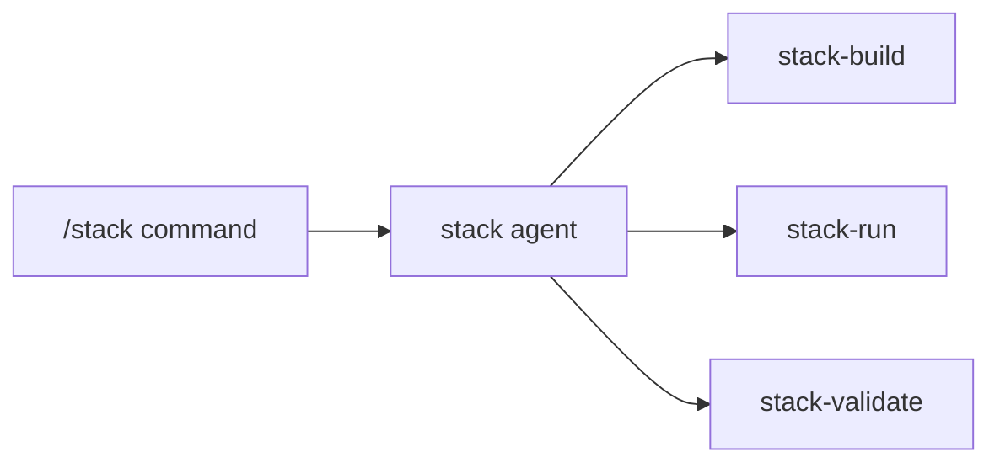

# README Enhancement Design

**Date:** 2025-12-22
**Status:** Implemented

## Overview

Enhanced the Skill Stack README to serve two audiences: developers exploring Claude Code plugins and existing users needing reference material.

## Design Decisions

| Aspect | Decision | Rationale |
|--------|----------|-----------|
| Audience | Explorers + existing users | Primary use cases |
| Hero section | Problem/solution statement | Creates immediate resonance |
| Diagrams | Architecture + execution + YAML-to-visual | Visual learners, shows capabilities |
| Examples | Use-case stories with narrative | Relatable, shows real-world value |
| Length | ~200 lines, link to docs | Scannable, not overwhelming |
| Builder demo | After Quick Start | Shows UX before YAML output |

## Structure

1. Title + one-line description
2. The Problem (pain points)
3. The Solution + Architecture diagram
4. Installation
5. Quick Start
6. Building a Stack (Socratic builder experience)
7. Example Workflows
   - Adding a New Feature (parallel execution)
   - Fixing a Bug (loop pattern)
   - Code Review Cycle (branching)
8. How Execution Works (diagram)
9. Skills table
10. Documentation links
11. License

## Diagrams Included

### Architecture

### Execution Patterns
Shows sequential, parallel, and loop execution models.

### Per-Example Flowcharts
Each use-case story includes a Mermaid diagram showing the workflow visually.

## Key Changes from Original

- Added problem/solution framing (was missing)
- Added Socratic builder demo (shows UX)
- Replaced feature list with narrative examples
- Added 5 Mermaid diagrams (was 0)
- Expanded from 55 lines to ~260 lines
- Removed superpowers plugin references (plugin-agnostic)
